# earace
We develop an earable sensing platform, it can extract your heart sound using in-ear microphones of an commercial available ANC earphone. Meanwhile, it can also grasp motion induced artifacts using a 9-DOF IMU sensor units. We mainly develop it for the current hot issues on earable computing and sensing. It can serve as a platform for:
1. Earable computing and sensing
2. Spatial audio
3. Heart sound analysis
4. Active noise cancellation
5. Sound localization and sensing

The platform consists of two parts:
1. A hardware that streams all collected samples
2. An client side app (Android or PC) that accept all the streams and performs real-time sensing operation. 

A snapshot of the board:
 
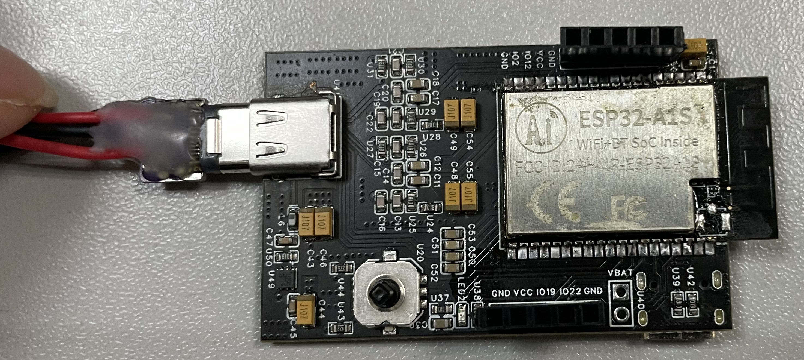

 
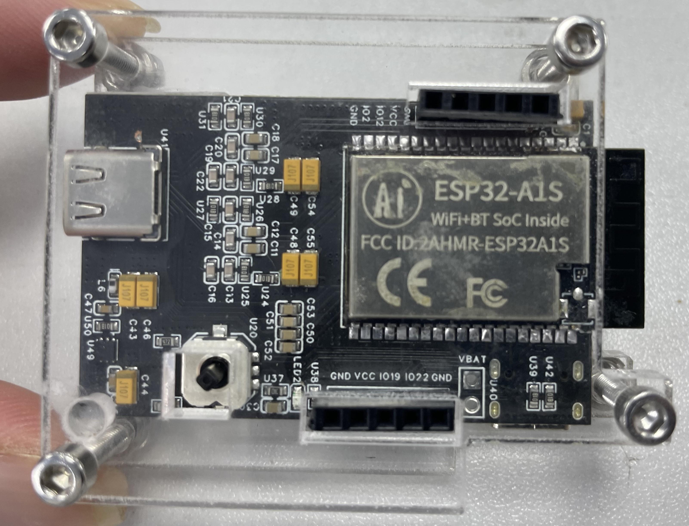

hardware demo show:
 

This hardware has plenty of resources:
1. Five key switches
2. LED
3. SD card
4. Power supply
5. Battery charge circuit
6. OLED interface
7. IMU interface
8. Up to 4 free IOs
9. Stereo audio inputs
10. Stereo audio outputs 

You can configure the hardware in three streaming or sampling modes:
1. WiFi hotspot
2. Bluetooth (develop in the progress)
3. SD card 

In the first page, you can select which mode you prefer:
 
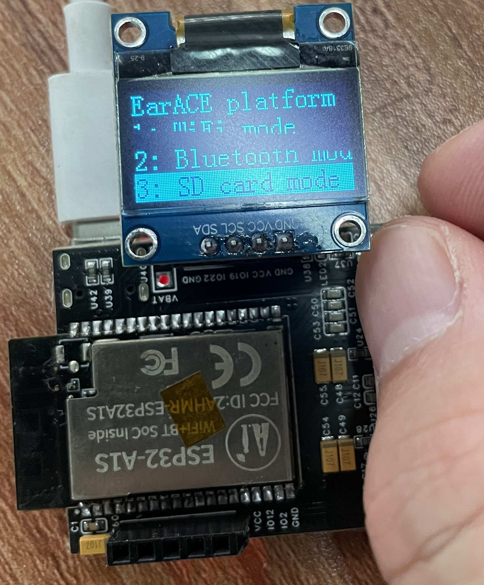

 
 In the WiFi mode, you can see the SSID and passwd, you can use you smartphone (with our app) or a laptop to accept UDP or TCP streams. The app can visulize the sampled results in real-time and it can also store the samples in local storage. 
 
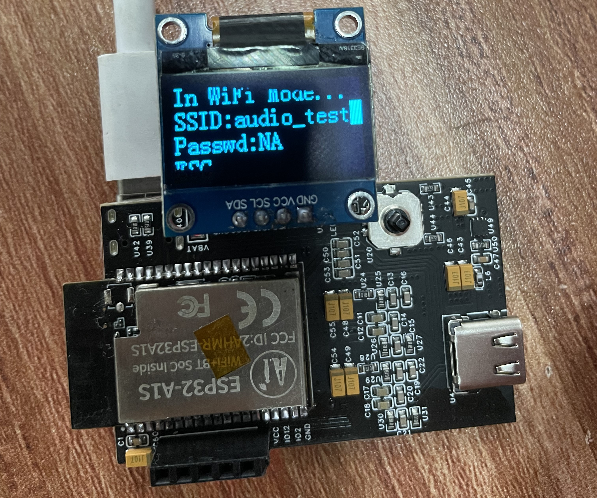

The BLE mode is developed in the progress. 

In SD card mode, you need no smartphone or laptop as a delegate to process samples. All the sampling results are stored in the SD card. If no SD card is found or SD card is corupted, the OLED screen would show the results; otherwise, the OLED would notify check ok. 

 
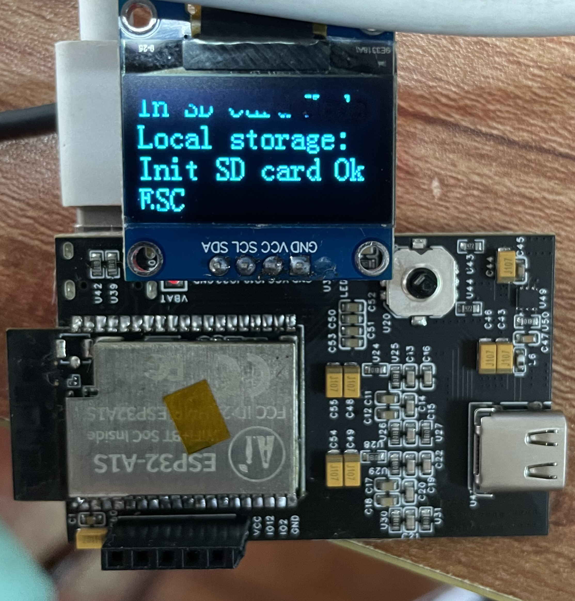

When in the SD card mode, if you active recording, an LED would flash, notify that it is in the middle of recording. And the OLED would tell you the name of the recorded file. If the LED stops flashing, the recording is over. 
 
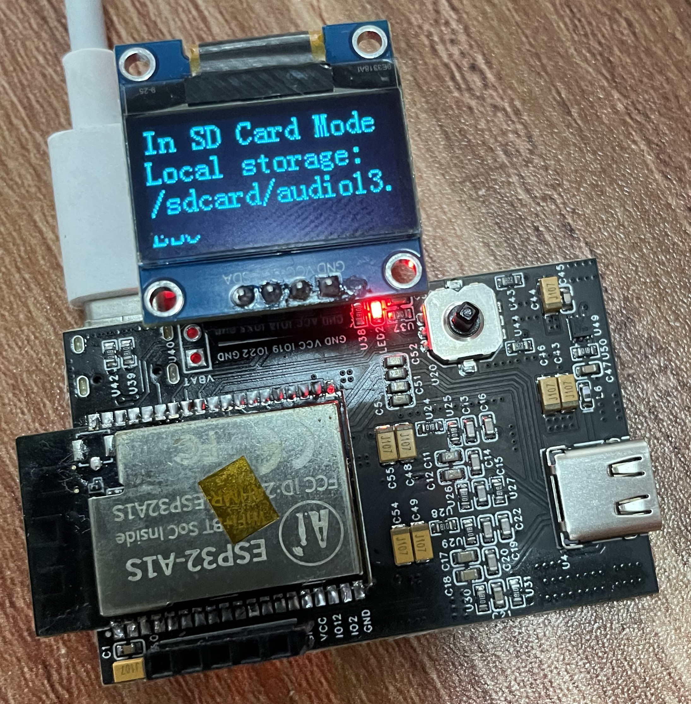

Android app snapshots:
 

Heartsound results:
 
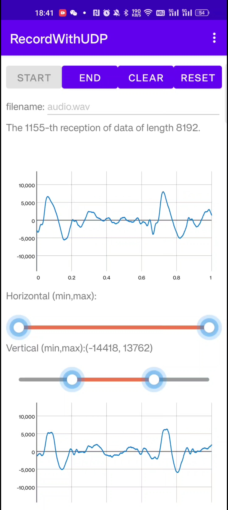

We have run extensive results under different environments. It can even work reliably under scenarios with intensive noises (over 80dB), say the waiting room of a railway station. 

 

Settings for the app:
 
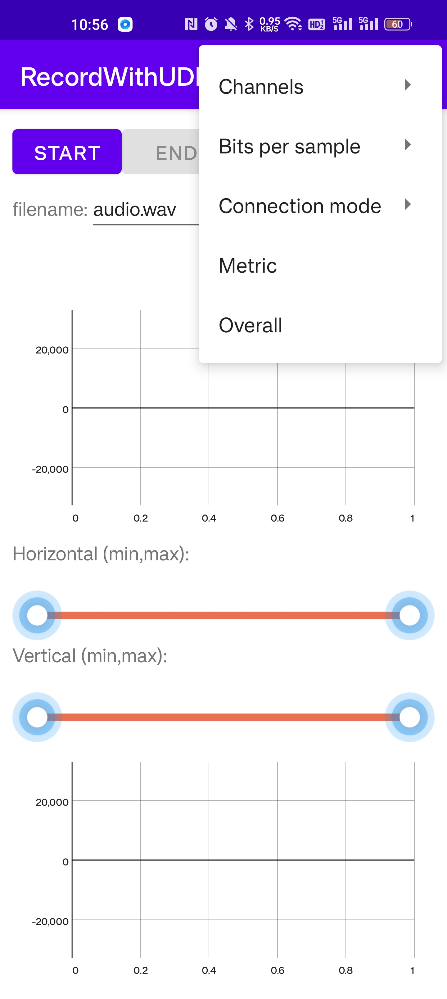

 
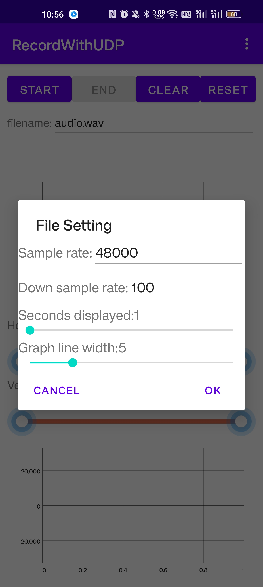

 

 
 
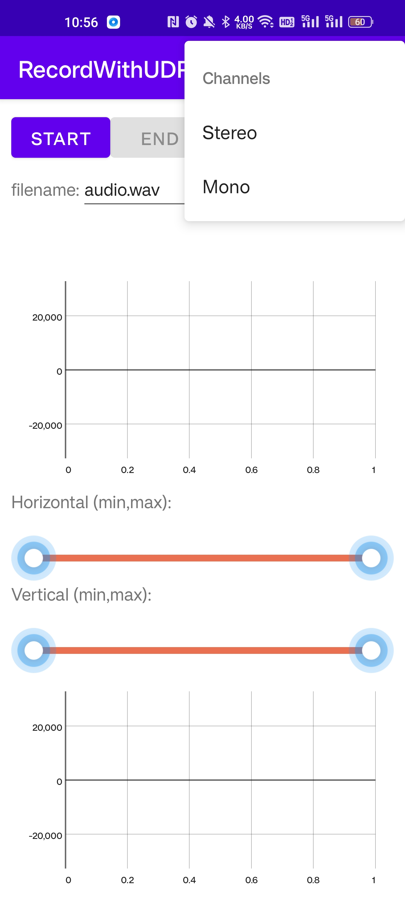

 
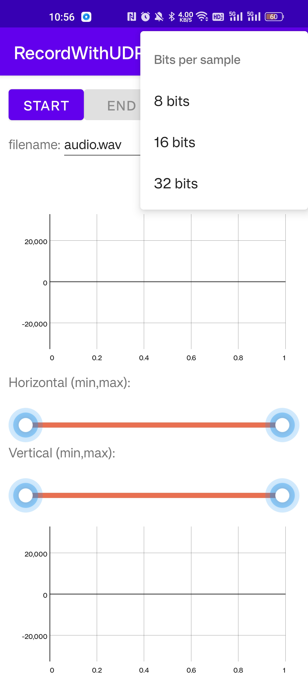

 
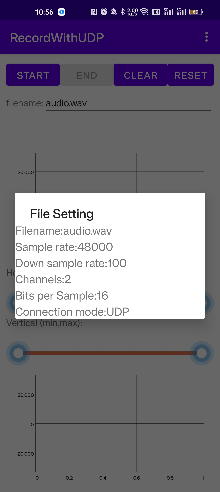

Related publication:

    @article{cao2023heartprint,
      title={HeartPrint: Passive Heart Sounds Authentication Exploiting In-Ear Microphones},
      author={Cao, Yetong and Cai, Chao and Li, Fan and Chen, Zhe and Luo, Jun},
      journal={Heart},
      volume={50},
      number={S1},
      pages={S2},
      year={2023}
    }
    
    @article{cao2023earace,
      title={EarAce: Empowering Versatile Acoustic Sensing via Earable Active Noise Cancellation Platform},
      author={Cao, Yetong and Cai, Chao and Yu, Anbo and Li, Fan and Luo, Jun},
      journal={Proceedings of the ACM on Interactive, Mobile, Wearable and Ubiquitous Technologies},
      volume={7},
      number={2},
      pages={1--23},
      year={2023},
      publisher={ACM New York, NY, USA}
    }

